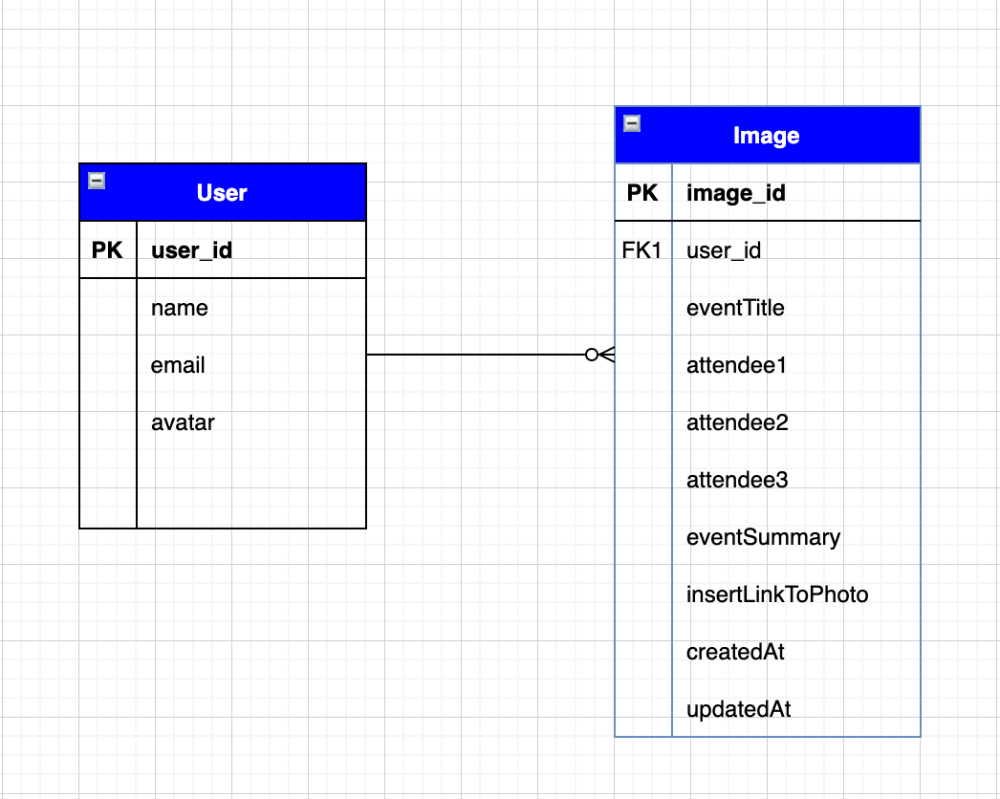

# [FotoFacts](https://github.com/heggy231/FotoFacts)
Fotofacts is an app used to organize your photo collection. Each individual user can create a profile, or login through github, upload a photowith all specific details of the event and see a library of their Photos in one place.
So if you have you ever looked through your photos and forgot the details associated with a photo (event title, attendees, etc.) and wished you could recall that memory. No need to fret Fotofacts is the resolution.
<br>
# [FotoFacts App Demo](https://sleepy-wave-68635.herokuapp.com)
## Tools:
1. HTML
1. CSS
1. JAVASCRIPT
1. GITHUB
1. JSON
1. BOOTSTRAP
1. HEROKU
1. NPM PACKAGE MANAGER
1. POSTGRES DATABASE
1. SEQULIZE ORM
1. PASSPORT.JS
1. [DOG API](https://dog.ceo/dog-api/)
### Frontend
<div align="center">  
  
  
  
  
  
  
</div>
</td><td valign="top" width="33%">
### Backend
<div align="center">  
  
  
  
  
</div>
</td><td valign="top" width="33%">
### DevOps
<div align="center">  
  
</div>
</td></tr></table>
<br/>
## Developed by:
- [Heggy](https://www.linkedin.com/in/castah/)
- [Teila](https://www.linkedin.com/in/Teila-Garraway/)
- [Avery]()
## Detailed summary (for Mac)
1. Check if you have homebrew already installed
```
brew -v
```
2. If it is not installed, install it
```
/usr/bin/ruby -e "$(curl -fsSL https://raw.githubusercontent.com/Homebrew/install/master/install)"
```
3. If you are asked for your computer's password, enter it at the prompt
4. Press `RETURN` to continue
5. Confirm that homebrew is installed with `brew -v`
6. Check to see if PostgreSQL is already installed
```
psql --version
```
7. If PostgreSQL is not installed, use homebrew to install it
```
brew install postgresql
```
8. Confirm that PostgreSQL is installed with `psql --version`
9. Start the database server
```
brew services start postgresql
```
10. Initialize a shell to interact with the database
```
psql postgres
```
11. You know you are in the shell if you see a prompt that begins with `#`
12. While in the shell, list the databases with `\l`
13. Enter `q` to quit the listing of databases
14. Create a new role
```
CREATE ROLE dev_admin LOGIN PASSWORD 'admin';
```
15. Alter its permissions so that this new role is a superuser
```
ALTER USER dev_admin WITH SUPERUSER;
```
16. Verify that the role and permission level is created with `\du`
17. In a browser, navigate to your account in GitHub
18. Click on your avatar in the upper right
19. Click **settings**
20. Click **Developer settings**
21. Click **oAuth apps**
22. Click **Register a new application**
23. Complete the fields as follows
```
Application name -> gh-oauth-psql-demo
Homepage URL -> http://locahost:8080
Authorization callback URL -> http://localhost:8080/auth/github/callback
```
24. Click **Register Application**
25. Copy **Client ID** and keep it somewhere you can get at it again
26. Click **Generate a new client secret**
27. Enter your GitHub password to confirm the last step
28. Copy **Client secret** and keep it somewhere you can get at it again
29. Upload a logo (optional)
30. Click **Update application**
---
## Steps below in VSCode
31. Open the project in in VSCode
32. Duplicate **.env-example**
33. Rename this duplicated file to **.env**
34. Fill in the missing values while making sure there are no spaces
```
GITHUB_CLIENT_ID=**\*\***
GITHUB_CLIENT_SECRET=
DB_HOST=localhost
DB_PORT=5432
DB_NAME=fotofacts
DB_USER=<fill in Windows only>
DB_PASS=<fill in Windows only>
// inside of your .env file
```
35. Open a new terminal instance within VSCode
36. Using the terminal instance, create the database
```
npx sequelize-cli db:create
```
37. Open new PostgreSQL shell instance within VSCode
```
psql postgres
```
38. List the databases with `\l` and verify that the database **gh_oauth_psql_demo_dev** has been created
39. Using the terminal instance, run a migration in order to build the **Users** table
```
npx sequelize-cli db:migrate
```
40. Return to the PostgreSQL shell instance and connect to the database that was created in step 36
```
\c gh_oauth_psql_demo_dev
```
41. Verify that the **Users** table was created (note that it will not have any rows)
```
SELECT * FROM "Users";
```
42. Using the terminal instance, start the application
```
npm run dev
```
43. In a browser, navigate to **localhost:8080**
44. Click _Login_
45. At the GitHub prompt, click _Authorize this application_
46. In the PostgreSQL shell, execute `SELECT * FROM "Users";` to verify that you are now a user listed in the database
---
## ERD
- [live ERD](https://app.diagrams.net/#G1kp7jivxXKaWsECSBpltwKVHOv3m3nlXI)

### FotoFacts RESTful Routing Overview
Routes for Photos (Users coming soon)
| HTTP Verb | Route                 | RESTful description | Purpose                           |
| :-------- | --------------------- | ------------------- | --------------------------------- |
| GET       | \*                    | catchAll            | 404 error handling.               |
| GET       | /heartbeat            | resSend             | Sanity check.                     |
| GET       | /                     | static page         | FotoFacts homepage.               |  |
| GET       | /auth/github          | passportGithubAuth  | Sets Github Auth.                 |
| GET       | /auth/github/callback | passportGithubCB    | Call back action for Github Auth. |
### FotoFacts Models
- User
| Attribute | Example value                    |
| :-------- | -------------------------------- |
| avatarURL | https://placeimg.com/128/128/any |
| firstName | Junghae                          |
| lastName  | Moon                             |
| email     | kimchi@naver.kr                  |
- Photo
| Attribute          | Example value                    |
| :----------------- | -------------------------------- |
| title              | Eating at Costco                 |
| category           | vacation                         |
| attendee1FirstName | SoJong                           |
| attendee1LastName  | Lee                              |
| attendee2FirstName | Teila                            |
| attendee2LastName  | Jones                            |
| attendee3FirstName | Avery                            |
| attendee3LastName  | Song                             |
| description        | After a long week                |
| url                | http://placeimg.com/640/480/food |
### sample code:
- Users Model:
npx sequelize-cli model:generate --name User --attributes firstName:string,lastName:string,email:string,avatarURL:string,loginStrategy:string,loginStrategyId:string,username:string
- Photo Model:
npx sequelize-cli model:generate --name Photo --attributes title:string,category:string,attendee1FirstName:string,attendee1LastName:string,attendee2FirstName:string,attendee2LastName:string,attendee3FirstName:string,attendee3LastName:string,description:string,url:string,userId:integer
